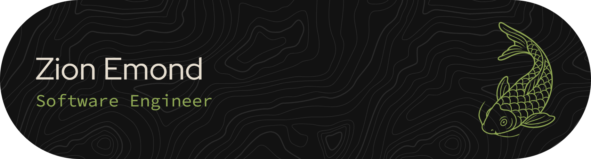

👋 I'm Zion Emond: a software engineer currently working for [CQL LLC](https://www.cqlcorp.com/) developing enterprise ecommerce solutions at scale. 

I specialize in creating web-based interfaces, both frontend and backend, mainly with JavaScript-based frameworks like React.js and Node.js.

Currently my favorite stack is:
* TypeScript
* React.js
* Node.js
* Next.js

But I've also touched:
* Express (or at least an Express derivative)
* GraphQL
* JQuery
* C#
* ASP.NET
* Python
* PostgreSQL
* AWS Lambdas/SDK

⚡ Fun fact: I almost always sneeze at least three times. Don't bother saying 'bless you' until after the third sneeze, or you're certain that I'm finished sneezing.

<h1>🔭 Projects</h1>

My main goal with any project I do is to learn something new. I love constantly learning new things, it's what keeps me going.

[shopify-metadata-migrator](https://github.com/WarriorAchilles/shopify-metadata-migrator) - Since I work in the ecommerce space currently, I created a CLI tool to help speed up the process of metafield and metaobject configuration in Shopify. It automatically copies metafield and metaobject definitions using the Shopify Admin GraphQL API and Node.js. The use case I created it for was for copying definitions from one store to another, e.g. dev to prod. It's published on [NPM](https://www.npmjs.com/package/shopify-metadata-migrator) so anyone can use it!

[NanoHabits](https://github.com/WarriorAchilles/NanoHabits) - This is a project I'm currently working on off and on. My goal here is to create a minimalist habit tracker app that uses AI to help users break down their goals into small, actionable, daily habits.

<!--
**WarriorAchilles/WarriorAchilles** is a ✨ _special_ ✨ repository because its `README.md` (this file) appears on your GitHub profile.

Here are some ideas to get you started:

- 🔭 I’m currently working on ...
- 🌱 I’m currently learning ...
- 👯 I’m looking to collaborate on ...
- 🤔 I’m looking for help with ...
- 💬 Ask me about ...
- 📫 How to reach me: ...
- 😄 Pronouns: ...
- ⚡ Fun fact: ...
-->
